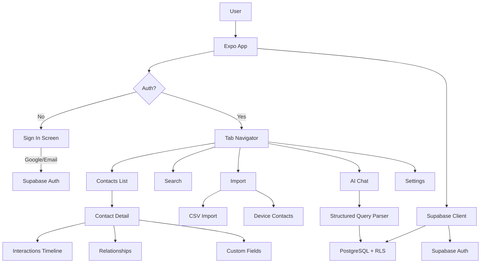
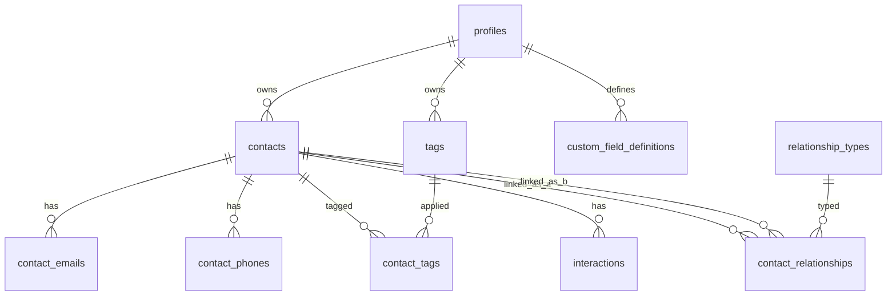

# Build Personal Relationship Manager Mobile App

## Overview

Build a full-featured Personal Relationship Manager (PRM) mobile app using Expo (React Native) with Supabase backend. The app enables users to manage their personal and professional network with LinkedIn CSV import, device contact sync, custom fields, contact-to-contact relationships, interaction tracking, search/filtering, and an AI-powered query interface. Multi-user with Google Sign-In.

## Problem Frame

Maintaining personal and professional relationships is hard. People lose track of when they last contacted someone, forget connections between people, and have their network data scattered across LinkedIn, phone contacts, WhatsApp, and email. A PRM consolidates all this into one searchable, queryable interface.

## Requirements Trace

- R1. Google Sign-In authentication (multi-user capable)
- R2. Import LinkedIn network from CSV
- R3. Import device contacts (expo-contacts)
- R4. Arbitrary custom fields with multiple data types (text, number, date, boolean, select, multi-select, url)
- R5. Link contacts to each other with typed relationships
- R6. Search and filter contacts on multiple dimensions
- R7. Track last-contacted date and interaction history
- R8. AI/agent query interface ("Who do I know at Google?")
- R9. Clean, elegant mobile-first UI/UX
- R10. Web-playable in devcontainer (Expo web)

## Scope Boundaries

- Mobile-first but must render on web via Expo for dev testing
- No WhatsApp/message reading in v1 (requires native modules beyond scope)
- No background sync of device contacts (one-time selective import)
- No push notifications in v1
- AI agent uses structured queries + text search (no vector embeddings in v1 -- that requires OpenAI key setup)
- No EAS build config (dev testing via web in this session)

## Context & Research

### Technology Stack

- **Runtime**: Node 22.22.1, pnpm 10.33.0
- **Framework**: Expo SDK 52, expo-router v4, React Native
- **Styling**: NativeWind v4 + Tailwind CSS 3.4.17
- **Backend**: Supabase (Postgres, Auth, Realtime, Storage) -- credentials in `.env.local`
- **Supabase CLI**: v2.84.4 available
- **Auth**: Supabase Auth with Google provider (signInWithIdToken for native, OAuth redirect for web)
- **CSV**: papaparse
- **Contacts**: expo-contacts
- **Search**: PostgreSQL FTS (tsvector) + pg_trgm for fuzzy matching

### Key Patterns

- File-based routing via expo-router: each file in `app/` is a route
- Supabase client singleton in `lib/supabase.ts`
- Auth context provider wrapping the app with Redirect-based route protection (SDK 52)
- Named exports over default exports (per CLAUDE.md conventions)
- Functional components with hooks

### Institutional Learnings

- JSONB + GIN index is 3x more storage-efficient than EAV and 1.3x faster for custom fields
- LinkedIn CSV exports only 7 columns: First Name, Last Name, Email Address, Company, Position, Connected On, URL
- ~80-90% of LinkedIn email fields are empty
- expo-contacts supports pagination for large contact lists
- NativeWind v4 requires `nativewind-env.d.ts` (not `nativewind.d.ts`)
- Supabase `expo-sqlite/localStorage` is the recommended storage adapter for auth sessions

## Key Technical Decisions

- **Custom fields via JSONB**: Store values in `contacts.custom_fields` JSONB column with schema defined in `custom_field_definitions` table. Avoids EAV performance issues while enabling arbitrary user-defined fields.
- **Relationship modeling**: Self-referencing junction table (`contact_relationships`) with typed relationships supporting symmetric (friend, spouse) and asymmetric (manager/report) patterns via `relationship_types` table.
- **Hybrid search**: Combine PostgreSQL `tsvector` full-text search (weighted: names=A, company/title=B, notes=C) with `pg_trgm` trigram similarity for typo-tolerant fuzzy matching.
- **Auth for web dev**: Use Supabase email/password sign-in for web development (Google native sign-in requires EAS build). Include Google sign-in button that works on native builds.
- **Separate tables for emails/phones**: One-to-many `contact_emails` and `contact_phones` tables instead of JSONB arrays -- enables deduplication during import and filtering by email/phone.
- **AI agent as structured query parser**: For v1, parse natural language questions into structured Supabase queries rather than requiring vector embeddings. Handles "Who do I know at X?", "When did I last talk to Y?", "Show me contacts tagged Z" etc.
- **NativeWind v4**: Stable with Expo SDK 52, using Tailwind CSS 3.4.17. Design system with consistent color palette, spacing, and typography.

## Open Questions

### Resolved During Planning

- **Auth method for web testing**: Use email/password for web dev, Google Sign-In for native builds. Both use the same Supabase Auth session.
- **Contact dedup strategy**: Match on source+source_id for same-source dedup. Cross-source dedup via normalized email or fuzzy name+company matching offered as a merge suggestion (not automatic).
- **Custom field storage**: JSONB column on contacts table, not EAV. Custom field definitions stored separately for UI rendering.

### Deferred to Implementation

- **Exact Supabase project setup**: Need to verify which extensions are enabled (pg_trgm, unaccent) and enable them if needed
- **Color palette specifics**: Will be finalized during UI implementation, starting with a blue-based professional palette
- **Pagination thresholds**: Exact page sizes for contact list will be tuned during implementation

## High-Level Technical Design

> *This illustrates the intended approach and is directional guidance for review, not implementation specification. The implementing agent should treat it as context, not code to reproduce.*

### Data Flow



### Database ERD



### Screen Map

```
app/
  _layout.tsx                    # Root: providers + auth gate
  sign-in.tsx                    # Email/password + Google button
  (app)/
    _layout.tsx                  # Auth check + redirect
    (tabs)/
      _layout.tsx                # Bottom tab navigator
      index.tsx                  # Home dashboard
      contacts.tsx               # Contacts list + search
      import.tsx                 # Import hub (CSV / Device)
      ask.tsx                    # AI query interface
      settings.tsx               # Settings + profile
    contact/
      [id].tsx                   # Contact detail
      [id]/edit.tsx              # Edit contact
      new.tsx                    # Add new contact
    import/
      csv.tsx                    # CSV import flow
      device.tsx                 # Device contacts import
```

## Implementation Units

- [ ] **Unit 1: Project Initialization & Configuration**

**Goal:** Set up the Expo project with all dependencies, TypeScript, NativeWind, and configuration files.

**Requirements:** R9, R10

**Dependencies:** None

**Files:**
- Create: `package.json`
- Create: `app.json`
- Create: `tsconfig.json`
- Create: `babel.config.js`
- Create: `metro.config.js`
- Create: `tailwind.config.js`
- Create: `global.css`
- Create: `nativewind-env.d.ts`
- Create: `.env.example`

**Approach:**
- Initialize Expo project with `pnpm create expo` or manually create package.json
- Install all dependencies: expo-router, @supabase/supabase-js, nativewind, papaparse, expo-contacts, expo-document-picker, expo-file-system, @expo/vector-icons, react-native-reanimated, react-native-safe-area-context, react-native-screens, expo-linking, expo-constants, expo-status-bar, expo-secure-store
- Configure TypeScript strict mode with path aliases (`@/*`)
- Set up NativeWind v4 with metro.config.js wrapper and babel preset
- Create global.css with Tailwind directives and a custom color palette
- Set main entry point to `expo-router/entry`

**Patterns to follow:**
- CLAUDE.md project structure conventions
- NativeWind v4 installation guide (nativewind-env.d.ts naming)

**Verification:**
- `pnpm install` succeeds without errors
- `pnpm exec expo start --web` launches without configuration errors

- [ ] **Unit 2: Supabase Database Schema**

**Goal:** Create all database tables, indexes, RLS policies, triggers, and search functions in Supabase.

**Requirements:** R1, R4, R5, R6, R7

**Dependencies:** Unit 1

**Files:**
- Create: `supabase/schema.sql` (full schema for reference/re-creation)
- Create: `lib/database.types.ts` (TypeScript types matching the schema)

**Approach:**
- Execute SQL against Supabase using the service role key via supabase CLI or direct REST API
- Enable extensions: `pg_trgm`, `unaccent`
- Create tables: `profiles`, `contacts`, `contact_emails`, `contact_phones`, `contact_addresses`, `contact_urls`, `tags`, `contact_tags`, `interactions`, `relationship_types`, `contact_relationships`, `custom_field_definitions`, `reminders`
- Add auto-updating `fts` tsvector generated column on contacts (weighted: name=A, company/title=B, notes=C)
- Add trigram indexes for fuzzy name search
- Create RLS policies: users can only CRUD their own data (filter by user_id or auth.uid())
- Create trigger: auto-create profile on auth.users insert
- Create trigger: update contacts.updated_at on new interaction
- Create RPC function: `search_contacts` combining FTS + trigram similarity
- Generate TypeScript types matching the schema

**Patterns to follow:**
- Supabase RLS conventions (auth.uid() = user_id)
- PostgreSQL generated columns for FTS

**Test scenarios:**
- RLS prevents cross-user data access
- FTS returns relevant results for name/company/note searches
- Trigram search handles typos ("Jonh" finds "John")

**Verification:**
- All tables created successfully in Supabase
- RLS policies are active on all tables
- `search_contacts` RPC returns ranked results

- [ ] **Unit 3: Supabase Client & Auth System**

**Goal:** Set up Supabase client singleton, auth context provider, and sign-in screen with email/password + Google placeholder.

**Requirements:** R1

**Dependencies:** Unit 1, Unit 2

**Files:**
- Create: `lib/supabase.ts`
- Create: `lib/auth/ctx.tsx`
- Create: `app/_layout.tsx`
- Create: `app/sign-in.tsx`

**Approach:**
- Create Supabase client with `expo-sqlite/localStorage` storage adapter
- Add AppState listener for auto-refresh token management
- Build auth context with session state, loading state, signOut function
- Root layout wraps app in SessionProvider + imports global.css
- Sign-in screen: clean card design with email input, password input, sign-in button, sign-up toggle, and a "Sign in with Google" button (functional on native, shows alert on web explaining it needs a native build)
- Use Redirect-based auth gating in (app)/_layout.tsx (SDK 52 pattern)

**Patterns to follow:**
- Supabase React Native auth quickstart
- expo-router authentication documentation

**Test scenarios:**
- New user can sign up with email/password
- Existing user can sign in
- Unauthenticated user is redirected to sign-in
- Authenticated user is redirected to app
- Sign out clears session and redirects to sign-in

**Verification:**
- Auth flow works end-to-end on web
- Session persists across page refreshes
- RLS-protected queries work with the session token

- [ ] **Unit 4: App Navigation & Screen Shells**

**Goal:** Build the tab navigator, all screen shells, and navigation structure.

**Requirements:** R9

**Dependencies:** Unit 3

**Files:**
- Create: `app/(app)/_layout.tsx`
- Create: `app/(app)/(tabs)/_layout.tsx`
- Create: `app/(app)/(tabs)/index.tsx`
- Create: `app/(app)/(tabs)/contacts.tsx`
- Create: `app/(app)/(tabs)/import.tsx`
- Create: `app/(app)/(tabs)/ask.tsx`
- Create: `app/(app)/(tabs)/settings.tsx`
- Create: `app/(app)/contact/[id].tsx`
- Create: `app/(app)/contact/[id]/edit.tsx`
- Create: `app/(app)/contact/new.tsx`
- Create: `app/(app)/import/csv.tsx`
- Create: `app/(app)/import/device.tsx`
- Create: `constants/colors.ts`
- Create: `constants/layout.ts`

**Approach:**
- (app)/_layout.tsx: auth check with Redirect, Stack navigator
- (tabs)/_layout.tsx: 5-tab bottom navigator (Home, Contacts, Import, Ask, Settings) with icons from @expo/vector-icons
- Each screen starts as a shell with the screen title and placeholder content
- Define color constants (blue-based professional palette) and layout constants (spacing, border radius)
- Use NativeWind throughout for consistent styling

**Patterns to follow:**
- expo-router tab layout with Ionicons
- Consistent header styling

**Verification:**
- All tabs render and navigate correctly
- Auth gating works (redirect to sign-in when not authenticated)
- Dynamic route `contact/[id]` resolves correctly

- [ ] **Unit 5: Contacts List Screen**

**Goal:** Build the main contacts list with FlatList, search bar, filter chips, and contact card components.

**Requirements:** R6, R9

**Dependencies:** Unit 4

**Files:**
- Create: `app/(app)/(tabs)/contacts.tsx` (implement)
- Create: `components/ContactCard.tsx`
- Create: `components/SearchBar.tsx`
- Create: `components/FilterChips.tsx`
- Create: `hooks/useContacts.ts`
- Create: `hooks/useDebounce.ts`

**Approach:**
- `useContacts` hook: fetch contacts from Supabase with search, tag filter, company filter, sort options. Uses the `search_contacts` RPC for search queries, standard select for browse mode.
- `SearchBar`: persistent search input at top with clear button
- `FilterChips`: horizontal ScrollView of tappable chips (All, tag-based, "Not contacted in 30+ days", "Recently added")
- `ContactCard`: avatar circle (initials fallback), name, company/title, last-contacted indicator, tag pills. Tappable to navigate to detail.
- FlatList with pull-to-refresh, pagination (20 per page), empty state
- FAB button to add new contact

**Patterns to follow:**
- React Native FlatList with `keyExtractor`, `onEndReached` for pagination
- Debounced search (300ms)

**Test scenarios:**
- Empty state shows "No contacts yet" with import CTA
- Search filters results in real-time
- Filter chips toggle and combine with search
- Pull-to-refresh reloads data
- Pagination loads more contacts on scroll

**Verification:**
- Contacts list renders with data from Supabase
- Search returns relevant results with typo tolerance
- Navigation to contact detail works

- [ ] **Unit 6: Contact Detail Screen**

**Goal:** Build the full contact detail view with collapsible sections, quick actions, and all contact data.

**Requirements:** R5, R7, R9

**Dependencies:** Unit 5

**Files:**
- Create: `app/(app)/contact/[id].tsx` (implement)
- Create: `components/ContactHeader.tsx`
- Create: `components/InteractionTimeline.tsx`
- Create: `components/RelationshipsList.tsx`
- Create: `components/CustomFieldsView.tsx`
- Create: `components/TagPills.tsx`
- Create: `hooks/useContact.ts`
- Create: `hooks/useInteractions.ts`
- Create: `hooks/useRelationships.ts`

**Approach:**
- ScrollView layout with sections:
  1. Header card: avatar, name, company/title, quick action icons (call, email, message)
  2. Stats bar: "Last contacted X days ago" | "N interactions" | "Connected since"
  3. Contact info: emails, phones, addresses, URLs (tappable)
  4. Tags: horizontal pill chips
  5. Relationships: linked contacts as small cards, grouped by category
  6. Activity timeline: reverse-chronological interaction list
  7. Custom fields: dynamically rendered based on field definitions
  8. Notes section
- Edit button in header navigates to edit screen
- "Log Interaction" FAB button
- Each section loads data independently for fast initial render

**Patterns to follow:**
- Collapsible section pattern with Pressable headers
- Time-relative formatting ("3 days ago", "Last week")

**Test scenarios:**
- All contact data displays correctly
- Quick actions open appropriate handlers (Linking.openURL for email/phone)
- Relationships section shows linked contacts
- Timeline shows interactions in reverse chronological order

**Verification:**
- Contact detail renders with all sections populated
- Navigation to/from detail screen works correctly

- [ ] **Unit 7: Add/Edit Contact Screen**

**Goal:** Build contact creation and editing forms with standard fields, custom fields, tag assignment, and validation.

**Requirements:** R4, R9

**Dependencies:** Unit 6

**Files:**
- Create: `app/(app)/contact/new.tsx` (implement)
- Create: `app/(app)/contact/[id]/edit.tsx` (implement)
- Create: `components/ContactForm.tsx`
- Create: `components/CustomFieldInput.tsx`
- Create: `components/TagSelector.tsx`
- Create: `hooks/useCustomFieldDefinitions.ts`
- Create: `hooks/useTags.ts`
- Create: `lib/validation.ts`

**Approach:**
- Shared `ContactForm` component used by both new and edit screens
- Standard fields: first name (required), last name, company, job title, department, birthday, notes
- Multi-value fields: add/remove emails (with label picker), phones (with label picker), addresses, URLs
- Custom fields section: render inputs dynamically based on `custom_field_definitions` (text input, number input, date picker, boolean switch, select dropdown, multi-select chips, URL input)
- Tag selector: show existing tags as tappable chips, "+" button to create new tag inline
- Custom field management: "Manage Custom Fields" button opens a modal to create/edit/delete field definitions
- Form validation: required fields, email format, phone format
- Save: upsert contact + related records (emails, phones, tags) in a batch

**Patterns to follow:**
- Controlled form inputs with useState
- ScrollView form layout with sections

**Test scenarios:**
- Creating a new contact saves to Supabase and appears in list
- Editing a contact preserves existing data and saves changes
- Custom fields render correctly based on their type
- Tag assignment works (create new + select existing)
- Validation prevents saving incomplete data

**Verification:**
- New contact appears in contacts list after creation
- Edit saves changes and returns to detail view
- Custom fields persist correctly in JSONB

- [ ] **Unit 8: LinkedIn CSV Import**

**Goal:** Build CSV import flow with file picker, preview, column mapping, and batch import with progress.

**Requirements:** R2

**Dependencies:** Unit 5

**Files:**
- Create: `app/(app)/import/csv.tsx` (implement)
- Create: `components/CSVPreview.tsx`
- Create: `components/ColumnMapper.tsx`
- Create: `components/ImportProgress.tsx`
- Create: `lib/csv.ts`

**Approach:**
- Step 1: File picker (expo-document-picker for native, file input for web) to select CSV file
- Step 2: Parse with papaparse, show preview table (first 5 rows)
- Step 3: Auto-map columns using alias dictionary (handles LinkedIn's "First Name", "Last Name", "Email Address", "Company", "Position", "Connected On", "URL" columns). User can manually adjust mappings.
- Step 4: Import with progress bar. Batch insert in chunks of 100. Dedup on source='linkedin' + source_id=LinkedIn URL.
- Step 5: Summary screen showing imported count, skipped duplicates, errors
- Handle web-specific file reading (FileReader API) vs native (expo-file-system)

**Patterns to follow:**
- papaparse with `header: true`, `skipEmptyLines: true`
- Supabase batch upsert with onConflict

**Test scenarios:**
- LinkedIn CSV parses correctly with all 7 columns mapped
- Generic CSV with different column names gets auto-mapped where possible
- Duplicate imports are detected and skipped
- Large files (1000+ rows) import without crashing
- Malformed CSV shows error message

**Verification:**
- LinkedIn CSV import creates contacts in Supabase
- Imported contacts appear in contacts list with source='linkedin'
- Re-import updates existing instead of duplicating

- [ ] **Unit 9: Device Contacts Import**

**Goal:** Build device contacts import with permission handling, searchable contact list, selective import.

**Requirements:** R3

**Dependencies:** Unit 5

**Files:**
- Create: `app/(app)/import/device.tsx` (implement)
- Create: `components/DeviceContactList.tsx`
- Create: `lib/contacts.ts`

**Approach:**
- Request contacts permission with clear explanation
- Load device contacts with pagination (50 per page) using expo-contacts
- Show searchable list with checkboxes for selection
- "Select All" / "Deselect All" toggle
- Map device contact fields to app schema
- Dedup check against existing contacts (match on email or phone)
- Import selected contacts with progress indicator
- Web fallback: show message that device contacts are only available on mobile

**Patterns to follow:**
- expo-contacts pagination with pageSize/pageOffset
- Permission request flow with graceful denied state

**Test scenarios:**
- Permission denied shows appropriate message with settings link
- Device contacts load and display correctly
- Search filters device contacts locally
- Selected contacts import correctly
- Duplicate detection prevents re-importing same contact

**Verification:**
- Device contacts import flow works on native
- Web shows appropriate fallback message
- Imported contacts appear with source='device'

- [ ] **Unit 10: Contact Relationships**

**Goal:** Enable linking contacts to each other with typed relationships and viewing the relationship graph.

**Requirements:** R5

**Dependencies:** Unit 6

**Files:**
- Create: `components/AddRelationshipModal.tsx`
- Create: `hooks/useRelationships.ts` (implement)
- Create: `lib/relationships.ts`

**Approach:**
- Seed default relationship types: spouse, partner, friend, colleague, manager/report, sibling, parent/child, mentor/mentee
- "Add Relationship" button on contact detail opens modal
- Modal: search/select target contact, pick relationship type, add optional note
- Display relationships on both sides (if A is friend of B, B shows A as friend too)
- For asymmetric relationships, show the correct direction label (e.g., "manages" vs "reports to")
- Query uses RPC function that checks both contact_a_id and contact_b_id

**Patterns to follow:**
- Modal with contact search (reuse SearchBar component)
- Self-referencing junction table query pattern

**Test scenarios:**
- Creating a symmetric relationship shows on both contacts
- Creating an asymmetric relationship shows correct labels on each side
- Deleting a relationship removes from both sides
- Preventing self-relationships (can't link contact to itself)

**Verification:**
- Relationships appear on both contacts' detail screens
- Correct labels show for symmetric vs asymmetric relationships

- [ ] **Unit 11: Interactions & Activity Log**

**Goal:** Build interaction logging and activity timeline with type categorization and last-contacted tracking.

**Requirements:** R7

**Dependencies:** Unit 6

**Files:**
- Create: `components/LogInteractionModal.tsx`
- Create: `components/InteractionTimeline.tsx` (implement)
- Create: `hooks/useInteractions.ts` (implement)
- Create: `lib/interactions.ts`

**Approach:**
- "Log Interaction" FAB on contact detail opens modal
- Modal: select type (call, email, meeting, text, social, note, gift, other), direction (inbound/outbound/none), title, body, date/time (defaults to now)
- Timeline on contact detail: grouped by date with section headers ("Today", "This Week", "March 2026"), expandable entries
- Dashboard "Recent Activity" section: latest interactions across all contacts
- Trigger updates `contacts.updated_at` (proxy for last-contacted)
- Add `last_contacted_at` computed from latest interaction date

**Patterns to follow:**
- SectionList with date-based sections
- Relative time formatting

**Test scenarios:**
- Logging an interaction creates record and updates contact's last-contacted
- Timeline shows interactions in reverse chronological order
- Different interaction types show different icons
- Dashboard shows recent activity across all contacts

**Verification:**
- Interactions persist in Supabase
- Timeline renders correctly with grouping
- Last-contacted date updates on contact card in list

- [ ] **Unit 12: Search & Advanced Filtering**

**Goal:** Build comprehensive search with full-text search, fuzzy matching, and multi-dimension filtering.

**Requirements:** R6

**Dependencies:** Unit 5, Unit 11

**Files:**
- Create: `app/(app)/(tabs)/ask.tsx` (search portion)
- Create: `components/AdvancedFilters.tsx`
- Create: `hooks/useSearch.ts`
- Create: `lib/search.ts`

**Approach:**
- Primary search uses `search_contacts` RPC (FTS + trigram combined)
- Advanced filters panel (slide-up sheet): filter by tags (multi-select), company (searchable dropdown), last-contacted range ("Last 7 days", "Last 30 days", "More than 90 days ago"), source, has email/phone, custom field values
- Filters combine with search query
- Sort options: relevance (when searching), name A-Z, last contacted, recently added
- Save filter presets for quick access

**Patterns to follow:**
- Bottom sheet for filter panel
- Chip-based filter display showing active filters

**Test scenarios:**
- FTS finds contacts by name, company, notes
- Trigram search handles typos
- Multiple filters combine correctly (AND logic)
- "Not contacted in 90 days" returns stale contacts
- Clear filters resets to default view

**Verification:**
- Search results are relevant and ranked
- Filters work independently and combined
- Performance is acceptable with 1000+ contacts

- [ ] **Unit 13: AI Query Interface**

**Goal:** Build a chat-like interface where users can ask natural language questions about their network.

**Requirements:** R8

**Dependencies:** Unit 12

**Files:**
- Create: `app/(app)/(tabs)/ask.tsx` (implement fully)
- Create: `components/ChatBubble.tsx`
- Create: `components/SuggestedQuestions.tsx`
- Create: `lib/agent.ts`
- Create: `lib/queryParser.ts`

**Approach:**
- Chat-style UI with message bubbles (user questions + agent answers)
- Suggested question chips: "Who do I know at [company]?", "When did I last talk to [name]?", "Who haven't I contacted recently?", "Show contacts tagged [tag]"
- Query parser: regex + keyword matching to classify intent and extract parameters
  - Company lookup: "who * at {company}" -> filter by company
  - Last contact: "when * last * {name}" -> query interactions
  - Stale contacts: "haven't * contacted * {time}" -> filter by last_contacted_at
  - Tag lookup: "* tagged {tag}" / "show * {tag}" -> filter by tag
  - Relationship query: "who is connected to {name}" -> query relationships
  - Stats: "how many contacts" -> count query
- Results displayed as formatted cards/lists within the chat
- Fallback: if no intent matches, run FTS search with the query text
- No LLM API call needed -- pure structured query parsing for v1

**Patterns to follow:**
- Chat interface with FlatList (inverted)
- Intent classification with pattern matching

**Test scenarios:**
- "Who do I know at Google?" returns contacts with company matching Google
- "When did I last talk to John?" returns most recent interaction with any John
- "Who haven't I contacted in 3 months?" returns stale contacts
- Unrecognized queries fall back to text search
- Suggested questions populate the query and execute

**Verification:**
- Common PRM questions return accurate results
- Chat UI is responsive and scrollable
- Suggested questions cover key use cases

- [ ] **Unit 14: Home Dashboard & Settings**

**Goal:** Build the home dashboard with stats and recent activity, and settings screen with profile management and custom field management.

**Requirements:** R4, R9

**Dependencies:** Unit 11, Unit 7

**Files:**
- Create: `app/(app)/(tabs)/index.tsx` (implement)
- Create: `app/(app)/(tabs)/settings.tsx` (implement)
- Create: `components/DashboardStats.tsx`
- Create: `components/RecentActivity.tsx`
- Create: `components/CustomFieldManager.tsx`
- Create: `hooks/useDashboard.ts`

**Approach:**
- Dashboard: greeting with user name, stats cards (total contacts, contacted this week, stale contacts, upcoming birthdays), recent activity feed (last 10 interactions), quick actions (add contact, import, search)
- Settings: user profile card, custom field management (CRUD for field definitions), tag management, sign out button, app info
- Custom field manager: list existing definitions, add new with type picker, edit name/options, delete with confirmation

**Patterns to follow:**
- Card-based dashboard layout
- Settings as sectioned ScrollView

**Test scenarios:**
- Dashboard stats reflect actual data
- Recent activity shows latest interactions
- Custom field CRUD works and reflects in contact forms
- Sign out works correctly

**Verification:**
- Dashboard renders with live data
- Custom field changes propagate to contact forms
- Settings persist correctly

- [ ] **Unit 15: Import Hub & Polish**

**Goal:** Build the import hub screen connecting CSV and device import, add loading states, error handling, and UI polish across all screens.

**Requirements:** R2, R3, R9

**Dependencies:** Unit 8, Unit 9

**Files:**
- Create: `app/(app)/(tabs)/import.tsx` (implement)
- Create: `components/EmptyState.tsx`
- Create: `components/LoadingSpinner.tsx`
- Create: `components/ErrorBoundary.tsx`
- Create: `lib/utils.ts`

**Approach:**
- Import hub: two cards (LinkedIn CSV, Device Contacts) with icons and descriptions, linking to respective import flows
- Add consistent loading states (skeleton screens or spinners) across all data-fetching screens
- Add error boundaries with retry actions
- Add empty states with helpful CTAs for contacts list, interactions, relationships
- Polish: consistent spacing, shadows, border radius, active/pressed states on all tappable elements
- Utility functions: formatDate, formatRelativeTime, getInitials, truncate

**Patterns to follow:**
- Consistent empty state pattern across screens
- Skeleton loading pattern

**Verification:**
- Import hub navigates to correct import flows
- All screens handle loading/error/empty states gracefully
- UI is consistent and polished across all screens

## System-Wide Impact

- **Interaction graph:** Auth context wraps the entire app. Supabase client is used by all data-fetching hooks. Changes to the schema require updating `lib/database.types.ts`.
- **Error propagation:** Supabase errors bubble up through hooks to UI components. Each hook should return `{ data, error, isLoading }` consistently.
- **State lifecycle risks:** Optimistic updates not used in v1 -- all mutations wait for server confirmation. No offline support (requires network).
- **API surface parity:** All data access goes through the Supabase client with RLS. No direct SQL from the client.

## Risks & Dependencies

- **Supabase project setup**: Need to verify/enable pg_trgm and unaccent extensions. May need to run SQL via supabase CLI or dashboard.
- **NativeWind SDK 52 compatibility**: Known issues exist -- may need `--clear` cache. Web rendering should work well.
- **expo-contacts on web**: Not available. Import flow must show appropriate fallback.
- **Google Sign-In on web**: Requires OAuth redirect flow, not native SDK. For this session, email/password is the primary auth method.
- **Large CSV imports**: May hit Supabase rate limits or request size limits. Batch in chunks of 100 with delay between batches if needed.

## Phased Delivery

### Phase 1: Foundation (Units 1-4)
Project setup, database schema, auth, navigation shell. After this phase, the app boots, authenticates, and navigates.

### Phase 2: Core CRUD (Units 5-7)
Contacts list, detail view, add/edit. After this phase, users can manually manage contacts.

### Phase 3: Import (Units 8-9)
CSV and device contact import. After this phase, users can bulk-load their network.

### Phase 4: Relationships & Activity (Units 10-11)
Contact linking and interaction tracking. After this phase, the relationship graph and activity timeline are functional.

### Phase 5: Search & Intelligence (Units 12-13)
Advanced search/filtering and AI query interface. After this phase, users can find and query their network.

### Phase 6: Dashboard & Polish (Units 14-15)
Home dashboard, settings, and overall UI polish. After this phase, the app is complete and polished.

## Sources & References

- Expo Router docs: https://docs.expo.dev/router/introduction/
- Supabase Auth (React Native): https://supabase.com/docs/guides/auth/quickstarts/react-native
- NativeWind v4: https://www.nativewind.dev/docs/getting-started/installation
- expo-contacts: https://docs.expo.dev/versions/latest/sdk/contacts/
- papaparse: https://www.papaparse.com/
- PostgreSQL pg_trgm: https://www.postgresql.org/docs/current/pgtrgm.html
- Supabase Full-Text Search: https://supabase.com/docs/guides/database/full-text-search
- Monica CRM (reference implementation): https://github.com/monicahq/monica
